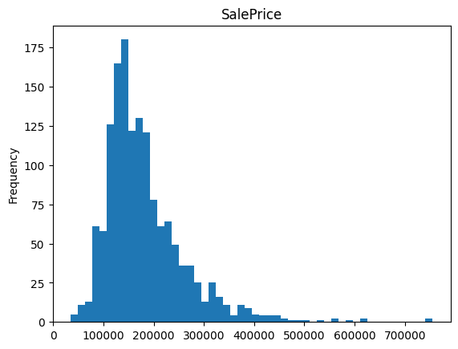
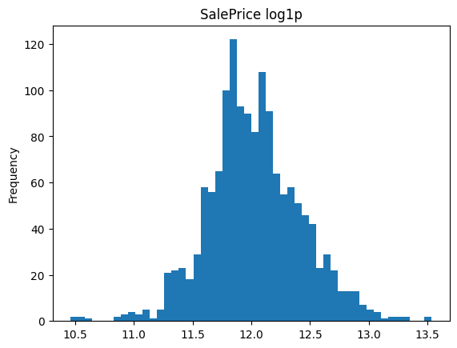

<!-- omit in toc -->
## Languages

---

<!-- omit in toc -->
## Frameworks

---

<!-- omit in toc -->
## Table of Contents
- [Introduction](#introduction)
- [Project Workflow](#project-workflow)
  - [Feature Engineering](#feature-engineering)
  - [Model Training](#model-training)
- [Interpretation / Most Informative Features by SHAP](#interpretation--most-informative-features-by-shap)

## Introduction
This project is the final task for the Machine Learning course at [BigDataLab](https://www.bigdatalab.com.ua/).
The goal was to train an ML model for a regression problem using the [House Prices dataset](https://www.kaggle.com/competitions/house-prices-advanced-regression-techniques/overview) and achieve an RMSLE lower than 0.15.

Tree-based models and ensembles were used to reach this goal, such as **Decision Tree**, **Random Forest**, **XGBoost**, and **LGBM**.

---

## Project Workflow

### Feature Engineering

1. Built a [Pipeline Template abstract class](src/pipelines/pipeline_template.py) using the [Template Method](https://refactoring.guru/design-patterns/template-method) design pattern.
2. Inherited from it in the [TreeSimilarPipeline](src/pipelines/tree_similar_pipeline.py) class, where feature engineering transformations for tree-based models were added.
3. To comply with the [DRY](https://en.wikipedia.org/wiki/Don%27t_repeat_yourself) principle, created a general class for all pipelines: [HousePriceProcessor](src/house_price_processor.py).
4. For feature research, implemented a helper class: [FeatureManager](src/feature_manager.py).
5. In the [feature_engineering](src/feature_engineering.ipynb) notebook, the following steps were performed:
   - Dropped features with high entropy (only id)
   - Filled missing values
   - Aggregated categories to reduce outliers
   - One-hot encoding
   - Quantile transformation
   - Year validation (1800 < year < 2016)
   - Dropped highly correlated features

---

### Model Training

1. Created a [Teacher](src/teacher.py) class with convenient methods for the training process. All models are instances of this class.
2. In the [main](src/main.ipynb) notebook, the data was split into train and validation sets (90%/10%) due to the small dataset size. K-fold validation was also used.
3. The histogram of SalePrice had a long right tail, so a log transformation was applied to make the distribution more normal. This helps to:
   - Reduce the impact of outliers on model training
   - Make the distribution more symmetrical, which is beneficial for many models and metrics
   - Make metrics (e.g., RMSE, RMSLE) less sensitive to extreme values

**Before:**

**After:**

4. Model training was performed. The best hyperparameters were found using Optuna and grid search.
5. The following models were studied:
   - Decision Tree Regressor
   - Random Forest
   - XGBoost
   - LGBM
6. The best result was achieved by LGBM:
   - Valid K-fold RMSE: 26,996.88
   - Valid K-fold RMSLE: 0.128
   - Train RMSE: 13,953.89
   - Train RMSLE: 0.0688
   - Valid RMSE: 40,021.20
   - Valid RMSLE: 0.138
   - Test RMSLE (Kaggle): 0.133

---

## Interpretation / Most Informative Features by SHAP

