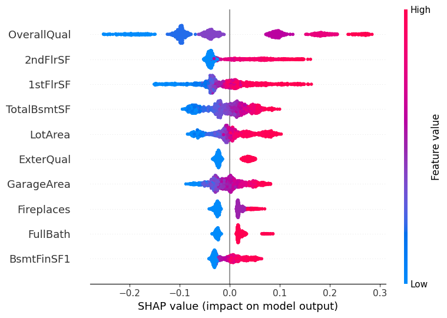
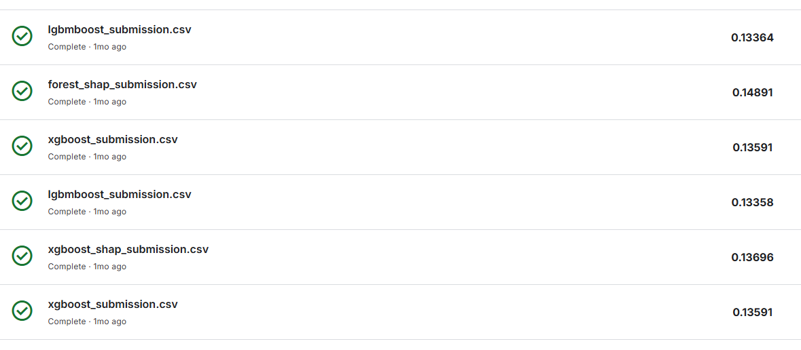

### Languages

---

### Frameworks

---

## Table of Contents
- [Introduction](#introduction)
- [Screenshots](#screenshots)
  - [Most informative features by SHAP](#most-informative-features-by-shap)
  - [Final RMSLE](#final-rmsle)

# Introduction
This project is the final task for the Machine Learning course at [BigDataLab](https://www.bigdatalab.com.ua/).
The task was to train an ML model on a regression problem using the [House Prices dataset](https://www.kaggle.com/competitions/house-prices-advanced-regression-techniques/overview) and achieve an RMSLE lower than 0.15.

I used tree-based models/ensembles to reach this goal, such as **Decision Tree**, **Random Forest**, **XGBoost**, and **LGBM**.

# Screenshots
## Most informative features by SHAP

## Final RMSLE 

